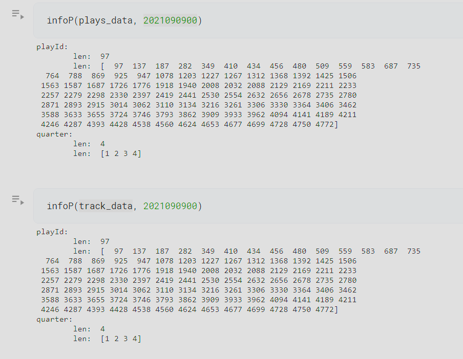
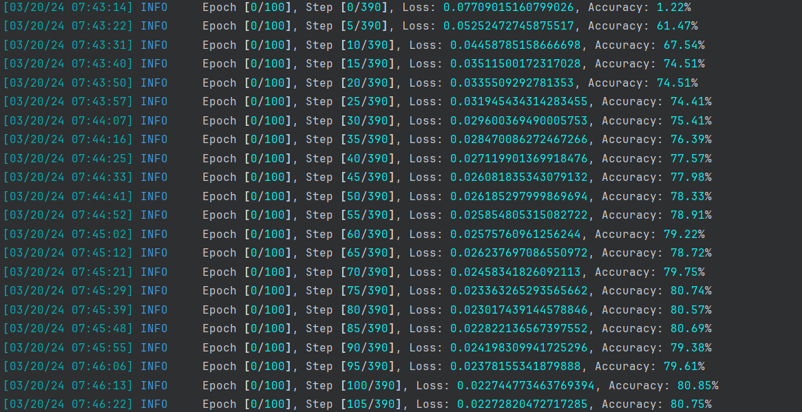
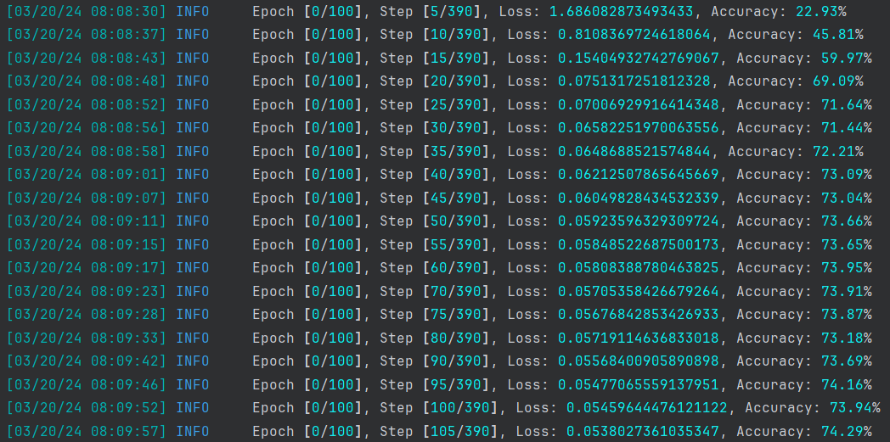

# [English](#English)-[Chinese](#中文) Bilingual Log

# English
---

# Experiment log:

## Experimemt: Implementing Exploratory Work on PFF Block Type Data

- Experiment Summary: Develop a classifier model to carry out predictions on PFF block type data
- Experiment Results: Successful
- Experiment Conclusions:
    - Identifier-related:
        - `gameid` is the unique identifier for each game.
        - `nflid` is the unique identifier for each player.
        - `playid` is not unique in the tracking data for each game.
        - *In the tracking data for each game, `nflid+playid` **cannot** be used as a unique identifier.*
        - *In the scouting data for each game, `nflid+playid` **can** be used as a unique identifier and does not repeat within a single game.*
        - When selecting the same `playid+gameid` in the tracking data of the same game, it is observed that `frameId` is a continuous number, suggesting that `playId` may represent a phase in the game, as the corresponding timestamps span only about `3.821s` on average (with a maximum of `8s` and a minimum of `2.6s`).
        - **Therefore, based on the above facts, it can be concluded that the `nflid+playid` composite ID from the scouting data of each game can correspond to a time period in the game, averaging only `3.8` seconds. This is reasonable and a viable method of data association.**
- Experiment Analysis: The experiment implemented a sequence-to-sequence neural network using an encoder-decoder structure formed by two LSTMs. Preliminary global accuracy reached 75% (in a sequence-to-sequence classification task), indicating that the neural network requires further optimization.

## Experiment: Attempt to Segment Data Sequences

- Experiment Summary: Implement segmentation on excessively long sequences within the dataset
- Experiment Results: Successfully accelerated training
- Experiment Conclusions:
  - After an initial exploration of the dataset, it was found that the list of unique playIDs for a single game in plays.csv and the tracking data are the same, meaning the data can be correlated.
  - Furthermore, this means that a single game can be divided into four sequences using the quarter identifier.
  - The segmentation was successfully implemented, and training was attempted.
  - Using the segmented sequences, both the training speed per batch and the apparent rate of accuracy increase were much faster. 

## Experiment: Implement Transformer

- Experiment Summary: Implement the Transformer model on top of the existing foundation to test performance
- Experiment Results: Not as good as LSTM/GRU
- Experiment Conclusions:
  - After implementing the Transformer model, it was found that during the training process, the model converged slower, and the accuracy increased slower.
  - Due to the characteristics of the Transformer model, it may not be suitable for the current dataset, hence not performing as well as LSTM/GRU models. 

## Experiment: Implement Win-Rate Model

- Experiment Summary: Implement the training of a win/lose model for a game
- Experiment Results: NOT GOOD
- Experiment Conclusions:
  - The experiment was based on the `preSnapHomeScore` and `preSnapVisitorScore` columns in playdata to determine if the home team won a game, but obviously training this as a sequence classification model was unsuccessful.
  - The experiment also tested another approach to eliminate the possibility of a sequence classification model design problem, which was to have the sequence labeling model label the home team's score, but this too was unsuccessful. Other PFF data information was also considered.
  - It can be concluded that there is no visible effective correlation between `preSnapHomeScore` and `preSnapVisitorScore` and the main data, and no features that neural networks could learn from.

## Experiment: Large-Scale Controlled Variable Comparative Experiment

- Experiment Summary: Conduct a large-scale controlled variable comparative experiment, experimenting with multiple target features based on GRU sequence lists and models
- Experiment Results: Effective target features: `pff_role` (76% accuracy at 5 epochs), `pff_playAction` (63% accuracy at 5 epochs with no change, needs improvement)
- Experiment Conclusions:
  - Features used in the experiment include: 
    -  passResult.json
    -  personnelD.json
    -  personnelO.json
    -  pff_passCoverage.json
    -  pff_passCoverageType.json
    -  pff_playAction.json
    -  pff_positionLinedUp.json
    -  pff_role.json
    -  playResult.json
    -  prePenaltyPlayResult.json
  - A large-scale controlled variable comparative experiment was conducted, experimenting with multiple target features based on GRU sequence lists and models.
  - The results show that the predictive accuracy of the `pff_role` feature can reach 76% (at 5 epochs) with the expectation to exceed 94% with subsequent training, while the predictive accuracy of the `pff_playAction` feature is only 63% (at 5 epochs) with no change, indicating a need for further improvement.
  - Most features failed to learn anything useful from data based on tracking data.
  - **If any of us have any promising sequence labeling target features that could yield effective results, please give me some suggestions, and I will experimentally validate them.**

---

# 中文

# 实验日志:

## 实验: 实施对pff block type数据的探索工作

- 实验概要: 构建一个分类器模型，实施对pff block type数据的预测
- 实验结果: 成功
- 实验结论:
    - 标识符相关:
        - gameid是每场比赛的独立标识符
        - nflid是球员的独立标识符
        - playid在追踪数据中的每场比赛并不唯一
        - *在每场比赛的追踪数据中，nflid+playid`不能`作为唯一标识符*
        - *在每场比赛的球探数据中，nflid+playid`可以`作为唯一标识符，不会在一场比赛中重复*
        - 当在追踪数据中同一场中筛选相同的playid+gameid时，会发现frameId是一个连续的数字，推断：playId可能代表游戏中的一个阶段，因为对应的时间戳的跨度只有`3.821s`左右（这是一个均值, 最大`8s`，最小`2.6s`）
        - **所以，通过上述的事实，可以得出结论：每场比赛中的球探数据的`nflid+playid`组成的联合id，可以对应每场比赛中的一个时间段，这个时间段只有平均`3.8`秒，这是合理的，且可以使用的数据联合方式**
- 实验分析: 实验实施了基于两个LSTM形成的编解码器解构，实现序列到序列的神经网络。经过实验，初步全局准确率可以达到75%（实施的是序列到序列的分类任务），神经网络有待优化。

## 实验: 尝试分割数据序列

- 实验概要: 对数据集每个比赛过长的序列实施分割
- 实验结果: 成功加速训练
- 实验结论:
  - 在实施初步对数据集的探索后发现，plays.csv和tracking data中单场比赛的playId unique列表相同，也就意味着可以将数据关联
  - 进一步来讲，这集可以利用quarter标识符将单个比赛分割为四个序列
  - 分割实现成功，尝试训练
  - 使用分割后的序列，使得单batch训练速度都加快许多，并且貌似准确率上升也更快 

## 实验: 实施Transformer

- 实验概要: 在原有基础上实施Transformer模型，测试性能
- 实验结果: 不如LSTM/GRU
- 实验结论:
  - 实施Transformer模型后，发现在训练过程中，模型收敛速度较慢，且准确率提升较慢
  - 由于Transformer模型的特性，可能不适合当前的数据集，因此，不如LSTM/GRU模型

## 试验: 实施胜率模型

- 试验概要: 实现一场比赛的输赢模型的训练
- 实验结果: 失败
- 试验结论:
  - 试验是根据 playdata中的 `preSnapHomeScore` 列和 `preSnapVisitorScore` 列判断一场比赛对主场是否胜利的，但是很明显以此训练的是序列分类模型，是失败的
  - 试验还为了排除序列分类模型设计问题，测试了另一种方式，也就是让序列标记模型对表记主场队伍得分，结果依然是失败，同时也考虑了其他pff数据的信息
  - 可以得出结论，`preSnapHomeScore` 和 `preSnapVisitorScore` 与主要数据之间，并不存在可见的有效关联，并不存在可以让神经网络所学习的特征

## 实验: 大规模控制变量对比实验

- 实验概要: 实施大规模控制变量对比实验, 基于GRU序列表及模型对于多个目标特征进行实验
- 实验结果: 有效目标特征: `pff_role`(76% 5 epoch), `pff_playAction`(63% 5epoch 无变化，需要改进)
- 实验结论:
  - 实验用到的特征有: 
    -  passResult.json
    -  personnelD.json
    -  personnelO.json
    -  pff_passCoverage.json
    -  pff_passCoverageType.json
    -  pff_playAction.json
    -  pff_positionLinedUp.json
    -  pff_role.json
    -  playResult.json
    -  prePenaltyPlayResult.json
  - 实验实施了大规模控制变量对比实验，基于GRU序列表及模型对于多个目标特征进行实验
  - 实验结果显示，`pff_role` 特征的预测准确率可以达到76%（5 epoch）随着后续训练预期可以超过94%，而 `pff_playAction` 特征的预测准确率只有63%（5 epoch），且没有变化，需要进一步改进
  - 绝大部分特征无法从以tracking data为基础的数据中学习到什么有用的信息
  - **只能说，各位有什么认为有希望的序列标记目标特征可以和我说，我会去做实验**
