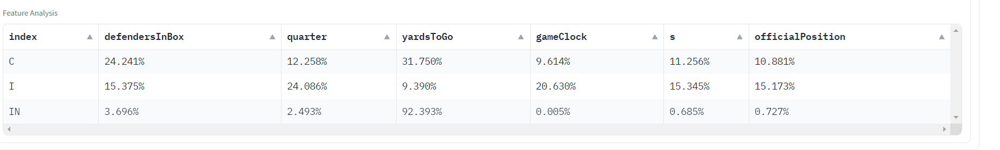

# Chapter 2: Data Preparation

Explain the necessity of data preprocessing here.

## 2.1 Data Acquisition and Interpretation

Please state the source of our dataset here, along with a brief introduction to the dataset (e.g. which datasets it includes: PFF scouting data, etc.)

## 2.2 Data Processing

Here, explain the concept and necessity of data processing in data science. Then state what steps need to be carried out in our project(2.2.1, 2.2.2 's title).

### 2.2.1 Normalization

State here that the normalisation method we used is min-max normalisation.

Can refer to: An explanation of min-max normalisation:

Min-Max normalization, also known as feature scaling, is a data preprocessing technique used to transform features to scale to a specific range, typically between 0 and 1. This method is particularly effective in ensuring that different features have equal importance during model training, especially in algorithms that involve distance measurements, such as K-Nearest Neighbors (KNN) and Principal Component Analysis (PCA).

The formula for Min-Max normalization is:

$$
X_{\text{norm}} = \frac{X - X_{\text{min}}}{X_{\text{max}} - X_{\text{min}}}
$$

Here, \(X\) represents the original data point, and \(X_{\text{min}}\) and \(X_{\text{max}}\) are the minimum and maximum values in the data, respectively. By applying this formula, the original data \(X\) is linearly transformed to the range \([0, 1]\).

For example, if you have a feature with original values [10, 20, 30], after applying Min-Max normalization, these values would transform to \([0, 0.5, 1]\).

The advantage of this method is its simplicity and quick adjustment of data to a specified range. However, it has drawbacks, such as being highly sensitive to outliers. If there are outliers in the data, they can significantly influence \(X_{\text{min}}\) and \(X_{\text{max}}\), leading to a skewed distribution of the other normalized values within the range.

### 2.2.2 Datasets Merging

Details:
Due to the dataset being divided into several data files and types, with some IDs not being entirely unique, direct merging was not feasible. This merging method necessitated studying the dataset to derive the following identifier-related conclusions:

- gameId is the unique identifier for each game.
- nflId is the unique identifier for each player.
- playId is not unique across games in the tracking data.
- In the tracking data for each game, nflId+playId cannot serve as a unique identifier.
- In the scouting data for each game, nflId+playId can serve as a unique identifier and will not be repeated.
- When filtering for the same playId+gameId in the tracking data for a single game, it was observed that frameId is a continuous number, leading to the inference that playId may represent a stage within the game, as the corresponding timestamp span is only around 4.1s (a mean value, with a maximum of 20s and a minimum of 1.8s).
- 
- Therefore, based on the above facts, it can be concluded that the combined ID consisting of nflId+playId from the scouting data for each game can correspond to a time segment within that game, with an average duration of only 3.8 seconds, which is reasonable and usable as a data merging approach.
- Initial exploration revealed that the unique playId lists in plays.csv and the tracking data for a single game are identical, implying that the data can be associated.

After exploring the data merging approach, we could implement a GameNFLData class that merges the base data on top of the existing base data classes (GamePffData, GameTrackingData, GamePlayData). Furthermore, the next generation of data loading code introduced a more convenient merging method: This version of data merging is faster and simpler. MergeNormData accepts the already loaded TrackingNormData, PffNormData, PlayNormData, GameNormData, and PlayerNormData as input parameters, automatically merging the three most important datasets: tracking, pff, and play. The remaining two datasets only need to be merged when necessary, controlled by the player_needed=False and game_needed=False parameters in the generate_dataset function of the DataGenerator.

## 2.3 Structured Data Loading

Details: 
The project employed object-oriented programming (OOP) to implement structured loading for the entire NFL dataset. This loading approach offers the benefit of clear organization and, in one version, the loaded dataset objects themselves were designed to be iterable, greatly simplifying the complexity of data retrieval in subsequent development processes.

The three main data components, namely PffData, PlayData, and TrackingData, correspond to the pffScoutingData.csv, plays.csv, and week{number}.csv files, respectively. For each of these components, corresponding classes were implemented: Game{name} for the dataset of each game and {name}Item for each data item. The Game{name} classes are iterable objects that support the __getitem__ method, enabling easy access to individual data items.

Furthermore, based on the uniqueness of the combination of gameId and playId, the three datasets were joined together to form a new dataset object named NFLData. This integration allows for seamless querying and retrieval of data across the different components.

The utilization of this structured data loading approach is highly convenient. By calling the .load method of the corresponding class, a dictionary-like object keyed by gameId is returned, containing Game{name}Data objects for each game. For instance, games = GameNFLData.loads(['xxx']) would load the specified games. Subsequently, accessing data for any gameId at any index becomes trivial.

This structured and object-oriented approach to data loading greatly enhances the friendliness and ease of use for subsequent development tasks, enabling developers to focus on higher-level analysis and processing of the NFL dataset.

## 2.4 Reusable Data Loader: Automated Data Preprocessing

Details:
There are two versions of this Data Loader in this project, corresponding to the initial way we processed data loading and the more advanced version we developed after gaining a deeper understanding of the data.:

1. Developer-oriented structured dataset objects, each supporting direct invocation of the .tensor() function to obtain preprocessed data ready for use in neural networks. By providing the names of columns as input features and the target features in the object members, the corresponding tensor can be obtained. The automatic preprocessing technique generates label tables for categories by analyzing the entire dataset, then converts them into index encodings acceptable as input to neural networks. Numeric data is automatically normalized, while temporal data is converted to timestamps. The function also supports overriding label tables: if the resize_range_overwrite and category_labels_overwrite parameters contain override configurations for specific features, the function directly uses these overrides instead of the automatically generated statistical functionality, resulting in a highly extensible design.

2. A version that loads data in a clear, simple, and easy-to-understand manner, storing the dataframe as an attribute within the object. In this version, the automatic preprocessing and normalization functionality becomes more concise and comprehensible, significantly enhancing readability and generalizability without sacrificing usability. The loaded TrackingNormData, PffNormData, PlayNormData, GameNormData, PlayerNormData, and MergeNormData objects are passed as initialization parameters to the DataGenerator. Data filtering can be performed directly on these classes before passing them to the generator or on the data generated by the DataGenerator. The generator supports generating tensors through the SimpleDataset class, which inherits from torch.utils.data.Dataset, and can also return NumPy arrays or dataframes. The generate_dataset function of the generator requires x_columns and y_column as inputs and, similar to the previous version, automatically handles label and numeric data. Whether to perform normalization on numeric data can be determined by the norm flag. This version provides a more flexible customization method for data preprocessing: directly using the data_type_mapping parameter, which is a dictionary where the key is the column name and the value is a function, equivalent to executing a map operation in Python, giving users more customization options.

# Chapter 3 Data Exploration

For this chapter, I need to give you an overall overview so that you have a general idea of how the narrative of the article will go. We attempted two broad directions (attempts at time series training and non-sequential training). One involved time series training tasks mainly using LSTM/GRU (utilising neural networks like LSTM/GRU trained on time series labels). We conducted some experiments and encountered some challenges, and ultimately this direction (sequential training) was proven to be less effective than non-sequential training. So, the content of our Data Exploration section covers the first broad attempt.

Between the major heading 'Chapter 3' and the subheading '3.1', there should be a passage explaining this (be like: In this project, we first attempted time series training models because we initially thought that if time series training was effective, it would certainly perform better than non-sequential training, for the following reason: next paragraph). Provide a summary, and this pattern should be followed for all major headings; there should not be a blank space between headings. (Should there be a Summary at the beginning and end of each Chapter to transition smoothly?)

When deciding whether to use time series neural network training or non-sequential neural network training, several key factors need to be considered. These factors will help determine the approach that best suits the project's requirements:

1. **Nature of the data**:

- **Time-dependent**: If your data changes over time and the time factor is crucial for prediction (e.g., stock prices, weather data, etc.), you should choose a time series neural network such as LSTM or GRU, which can handle the time dependencies in the data.

- **No time dependency**: If the data is static, or the order of data points does not depend on time (e.g., image recognition, certain types of classification tasks), you can use a non-sequential neural network, such as a fully connected network or a convolutional neural network (CNN).

2. **Task type**:

- **Predicting future data points**: For tasks that require predicting future values based on historical data (e.g., sales forecasting, demand forecasting, etc.), time series neural networks are a better choice.

- **Classification or recognition**: For tasks that involve image recognition, text classification, or other tasks that do not depend on time series data, non-sequential neural networks are more suitable.

3. **Data structure and format**:

- **Sequential data**: If the data is inherently sequential, especially if there are long-term dependencies between sequences, using networks designed to handle sequential dependencies (e.g., recurrent neural networks, RNNs) will be more effective.

- **Non-sequential data**: For non-sequential data, such as individual data points or datasets that do not require considering the time order, standard neural network structures are typically sufficient.

4. **Complexity and computational resources**:

- Time series neural networks (especially LSTMs and GRUs) are generally more computationally complex and require more computational resources and training time. If resources are limited, you may need to consider simpler network structures or methods to reduce model complexity.

5. **Experimentation and evaluation**:

- Before making a final decision, it is crucial to conduct preliminary experiments to evaluate the performance of different network models on the specific dataset and task. The experimental results can provide direct evidence to support the choice of which type of network to use. After this Data Exploration chapter, we found that time series training performed poorly, which was determined by the nature of the dataset. This is because many of the input feature classes in the dataset were not continuous over time series, meaning there were too many N/A values. This reason directly led us to decide to use non-sequential neural network models and machine learning models.

Knowledge: Overall, it can be divided into two broad directions, sequential and non-sequential. If we further subdivide the sequential direction, it depends on whether the data has timestamps or not. If the data has timestamps, then it is a time series task. If there are no timestamps, it is another regular sequential task (where the data is ordered).

## 3.1 Time series Task

In this section, provide an introduction to Time Series Tasks in the field of data science. Time series tasks encompass both time series labeling and time series forecasting tasks（We will attempt both of these two types of tasks in this chapter）. can refer to:

**Overview of Time Series Tasks**

Time series analysis involves the observation, analysis, and prediction of data points that are ordered in time. Typically characterized by continuous measurements arranged in chronological order, time series data often exhibit intrinsic correlations and patterns such as seasonal variations, trends, or cyclical fluctuations. The primary objective of time series tasks is to utilize historical data to forecast future events, identify trends, or detect anomalies.

**Characteristics of Time Series Data**

Time series data possess several distinct attributes:
1. **Time Dependency**: Values in the series are directly related to their preceding values.
2. **Seasonality**: Data exhibits regular and often predictable patterns that repeat over time.
3. **Trend**: Data shows a long-term inclination in one direction over time.
4. **Cyclicality**: Data demonstrates fluctuations over time, which may not be of fixed frequency and can extend beyond the data collection span.

**Applications of Time Series Analysis**

Time series analysis is extensively applied across various fields, including but not limited to:
- **Economics**: Forecasting economic activities, such as GDP growth rates and unemployment rates.
- **Finance**: Predicting stock and commodity market prices.
- **Meteorology**: Weather forecasting, including temperature, precipitation, and wind speeds.
- **Energy Management**: Predicting electricity demand to optimize energy distribution.

**Methods in Time Series Analysis**

A variety of methods are employed in time series analysis, including:
- **Autoregressive Models (AR)**: A model where a value is dependent on its previous values.
- **Moving Average Models (MA)**: A model where a value is dependent on the previous forecast errors.
- **Autoregressive Integrated Moving Average Models (ARIMA)**: Combines autoregressive and moving average models, suitable for non-seasonal data.
- **Seasonal ARIMA (SARIMA)**: Specifically designed to address seasonal variations in data.
- **Vector Autoregression (VAR)**: A model for dealing with multivariate time series.
- **Long Short-Term Memory Networks (LSTM)**: A deep learning approach particularly effective for addressing long-term dependencies.

The goals of time series analysis extend beyond forecasting future data points. They also include understanding the underlying dynamics of the data to improve decision-making and strategy formulation. Through in-depth analysis of historical data, time series models reveal trends and patterns hidden within complex datasets, providing more accurate business insights and predictive capabilities.

## 3.2 Model Exploration and Data Experiment

Provide a brief introduction to the content covered in the subheadings (what did we do?).

### 3.2.1 Neural Network Model 

#### 3.2.1.1 Long Short-Term Memory (LSTM)

can refer to:

LSTM stands for Long Short-Term Memory. It is a special kind of recurrent neural network (RNN) architecture.

RNNs are good at handling sequential data, but suffer from the vanishing/exploding gradient problem, making it difficult to learn long-term dependencies. LSTMs address this issue by introducing a gating mechanism and memory cells.

The key innovations in LSTMs include:

1. Forget Gate - Controls what information to discard from the previous cell state.

2. Input Gate - Controls how the current input and previous cell state are combined. 

3. Output Gate - Controls what gets output based on the cell state.

4. Memory Cell - Similar to the hidden state in a regular RNN, but allows information to be remembered for long periods.

With this carefully designed gating mechanism, LSTMs are much better at capturing long-term dependencies in sequential data. They have shown outstanding performance in natural language processing, speech recognition, time series forecasting, and other sequence tasks. LSTM is one of the mainstream neural network architectures for processing sequential data.

#### 3.2.1.2 Neural Network Model: Gated Recurrent Unit (GRU)

can refer to: 

GRU stands for Gated Recurrent Unit. It is another type of recurrent neural network, introduced as a simpler alternative to the LSTM architecture.

Like LSTMs, GRUs are designed to solve the vanishing gradient problem that standard RNNs face when learning long-term dependencies. However, GRUs have a simpler structure with fewer gates.

The key components of a GRU are:

1. Reset Gate - Decides how much of the previous memory to keep around.
2. Update Gate - Determines what information from the current input and previous state to use to compute the new state.

The reset and update gates in GRUs control the flow of information similar to the forget, input and output gates in LSTMs. However, GRUs have fewer tensor operations, making them more efficient to compute and faster to train compared to LSTMs.

While slightly less powerful than LSTMs in some cases, GRUs strike a good balance between model complexity and performance. They have been successfully applied to tasks like language modeling, speech recognition, and time series forecasting.

Overall, GRUs provide a simpler and more efficient gating mechanism compared to LSTMs for handling long-term dependencies in sequential data, while still offering better performance than standard RNNs.

#### 3.2.1.3 Transformer

For the neural network models or machine learning models that we used in this project, you can find some literature and directly use their explanations or diagrams of the model architectures. That way, more citations are included in report.

can refer to:
A Transformer is a type of neural network model designed for processing sequential data. It was originally introduced by the Google Brain team in 2017 in the paper "Attention Is All You Need", primarily for natural language processing (NLP) tasks.

Unlike RNNs, LSTMs, and GRUs that rely on recurrent structures to capture long-range dependencies in sequences, Transformers are entirely based on an attention mechanism to model the dependencies between input and output sequences.

The main components of a Transformer include:

1. Encoder - Processes the input sequence and computes a series of vectors to represent it.
2. Decoder - Receives the output of the encoder and generates the final target sequence.
3. Multi-Head Attention - Captures dependencies across different representational subspaces. 
4. Positional Encoding - Since Transformers have no recurrence or convolution, positional encodings are added to inject sequence order information.

Transformers use self-attention layers to directly model dependencies between any two positions, avoiding the path length constraints of RNNs and better handling long-range dependencies. They have shown outstanding performance on many NLP tasks such as machine translation, text generation, reading comprehension.

The introduction of Transformers has greatly advanced the field of NLP, and they have also achieved significant success in computer vision, speech recognition, and other domains. Well-known language models like BERT and GPT are variants built upon the Transformer architecture. Overall, Transformers represent a novel neural network architecture for sequence modeling.

### 3.2.3 Time Series Labeling Experiment

Based on the details, write the content with the assistance of AIGC. For example, regarding the experimental conclusion where we mentioned that due to the characteristics of the Transformer model, it may not be suitable for the current dataset, and therefore performed worse than the LSTM/GRU model. In this case, you can consult AI tools to understand the differences between these two model classes and in what scenarios the Transformer may underperform compared to LSTM/GRU models. This allows you to expand the analysis on this point.

you could ask: What are the key differences between Transformer and LSTM/GRU models? In what situations might Transformers underperform compared to LSTM/GRU for sequence modeling tasks?

it may answer: For example, it may highlight that Transformers excel at capturing long-range dependencies but struggle with sequential tasks that heavily rely on retaining state information or handling very long sequences. Conversely, LSTM/GRU models, with their gating mechanisms and memory cells, may be better suited for tasks where maintaining state over time is crucial.

Same to other section, you can use this approach to help you guys complete the writing.

Details:

In the initial stage of our technical approach, we first chose to experiment with LSTM/GRU neural networks. The experimental dataset included trackingdata as the input features and pffblocktype as the target label feature. For this sequence labeling task, we conducted a series of experiments:

The first experiment showed that the model achieved an accuracy of 80% on the test set. Through further tuning of hyperparameters and model architecture, we ultimately attained 94% accuracy on the test set. Subsequently, we attempted to segment the input data sequences. The experimental results indicated that this operation did not adversely affect the model's accuracy but did accelerate the training process.

Additionally, we explored the performance of the Transformer model on this task, with the following experimental overview:
- Based on the existing LSTM/GRU model, we implemented the Transformer model architecture to test its performance.
- The experimental results showed that the Transformer model performed inferior to the LSTM/GRU model.
- 
- Experimental analysis and conclusions:
   1) During training, the Transformer model exhibited a slower convergence rate, and its accuracy improvement was relatively gradual.
   2) Due to the architectural characteristics of the Transformer model, it may not be well-suited to the current dataset features, thus underperforming compared to the LSTM/GRU model.

Through this series of experimental explorations, we ultimately determined to adopt the LSTM/GRU neural network model for sequence labeling task modeling.

### 3.2.4 Time Series Forecasting Experiment

Details:

We conducted some experiments on win-rate models:

- Experiment Overview: Implemented a model to predict the winner of a game.
- Experimental Results: Failed
- 
- Experimental Conclusions:
  - The experiment attempted to determine whether the home team won a game based on the 'preSnapHomeScore' and 'preSnapVisitorScore' columns in the playdata. However, it became evident that training a sequence classification model on this data was unsuccessful.
  - To rule out potential design flaws in the sequence classification model, we tested an alternative approach where the sequence labeling model was tasked with predicting the home team's score. This attempt also failed, despite incorporating additional information from other pff data.
  - We can conclude that the 'preSnapHomeScore' and 'preSnapVisitorScore' columns lack a discernible, effective association with the main dataset, and there are no features that the neural network can effectively learn from these data points.

### 3.2.5 Interim Summary

The above two preliminary data exploration experiments were unsuccessful. However, we did not entirely lose hope and planned to conduct further exploration by performing large-scale experiments on the entire dataset. To avoid redundant work, we developed a method to replace training parameters and implemented such experiments (covered in the next subsection).

you can write this part like this (Don't copy it):

The initial attempts at developing win-rate prediction models based on the 'preSnapHomeScore' and 'preSnapVisitorScore' columns from the playdata were unsuccessful. Through these exploratory experiments, we concluded that these specific features lack a discernible association with the main dataset, failing to provide effective learning signals for the neural network models.

Despite the setbacks, we remained optimistic about uncovering valuable insights from the data through further exploration. To facilitate more comprehensive experimentation without redundant efforts, we developed a methodology to replace training parameters systematically. This approach would enable us to conduct large-scale experiments across the entirety of the dataset, potentially revealing previously overlooked patterns or relationships.

The next stage of our research involved implementing these large-scale experiments with varying parameter configurations, which will be detailed in the subsequent subsection. While the initial explorations did not yield the desired results, we recognized the importance of persevering and thoroughly investigating the data from multiple angles to maximize the chances of successful model development.

### 3.2.6 Implementation of Generalized Framework

Details:

Implementation of Neural Network Models

To facilitate extensive data exploration and model experimentation, we implemented a generalized neural network model framework designed to support flexible input/output configurations and parameter adjustments. The specific implementation details include:

Model Architectures
- We implemented sequence labeling neural networks based on LSTM and GRU architectures for modeling and predicting sequential data. These model architectures are widely employed in time series data processing tasks.
- A universal training configuration system was constructed, enabling flexible specification of model hyperparameters, optimizer settings, training iteration counts, and other critical training details.

Configuration Flexibility
- A configurable input/output feature selection mechanism was designed, allowing arbitrary features from the NFL dataset to be specified as model inputs and output labels, enabling a high degree of freedom in experimental setups.
- This capability facilitated the application of the control variable method, systematically adjusting input/output feature combinations and conducting large-scale batch experiments to comprehensively explore potential patterns and relationships within the data.

Experiment Templates
- Generalized experiment configuration templates were built, encompassing model architecture selection, feature engineering, and hyperparameter settings as core configuration elements.
- These templates laid the foundation for subsequent large-scale experiments, ensuring consistency and reproducibility throughout the experimental process.

By implementing the above components, we established a flexible and extensible neural network model framework, well-prepared for conducting a comprehensive exploratory study on the NFL dataset.

### 3.2.7 Large-Scale Experiments Facilitated by the Generalized Framework

Details:

#### Experimental Overview
To comprehensively explore potential patterns and relationships within the NFL dataset, we conducted large-scale control variable experiments based on the previously implemented generalized GRU sequence labeling neural network model framework. The experiments focused on modeling and predicting multiple target features.

#### Experimental Setup
- The input feature set included passResult.json, personnelD.json, personnelO.json, pff_passCoverage.json, pff_passCoverageType.json, pff_playAction.json, pff_positionLinedUp.json, pff_role.json, playResult.json, and prePenaltyPlayResult.json.
- 
- 
- The models took tracking data as the base input and performed sequence modeling and prediction on the aforementioned features.
- The experiments employed a control variable approach, systematically adjusting the target features to evaluate the model's predictive performance across different features.

#### Experimental Results
- 
- The model achieved its best performance in predicting the pff_role feature, reaching an accuracy of 83.8% after 5 training epochs, with an expected accuracy exceeding 94% after further training.
- For the pff_playAction feature, the model attained an accuracy of 68.6% after 5 epochs, with no observable improvement, necessitating further model optimization.
- For most other features, the model based on tracking data failed to learn effective prediction patterns.

#### Experimental Summary
Through systematic large-scale comparative experiments, we found that the model performed relatively well in predicting the pff_role and pff_playAction features, although there is room for improvement. However, for most other features, the current data did not yield satisfactory predictive performance, suggesting potential areas for improvement in data quality and feature engineering.

So, in the following chapter 4, We will attempt another direction: non-sequential training(which is successful).

### 3.2.8 Summary

A simple description of the work done in Chapter 3. 

Then explain that after restructuring the Data Loader (i.e. the second version of the Data Loader in 2.4 Reusable Data Loader: Automated Data Preprocessing), we discovered the reason for the poor performance of time series training, which was the pollution caused by N/A values in the time series. 

Although the data is sequential, this dataset is not suitable for sequential training. At the same time, we found in the experiments that the GameClock data can achieve good results using non-sequential training models. We will discuss this in detail in the next Chapter 4.

# Chapter 4 Data Modelling

## 4.1 Supervised Learning

Here introduce the concept of Supervised Learning. And explain that this dataset is suitable for Supervised Learning.

can refer to(This will help you guys understand the ML concept and DL concept):

Machine learning is a relatively broad concept that encompasses deep learning and other traditional machine learning algorithms.

After subtracting the deep learning subset from the machine learning set, what remains are the traditional machine learning algorithms, such as:

1. Supervised learning algorithms:
   - Decision trees
   - Random forests
   - Support vector machines
   - Logistic regression
   - Naive Bayes
   - K-nearest neighbors

2. Unsupervised learning algorithms:
   - Clustering algorithms (K-Means, DBSCAN, etc.)
   - Association rule mining
   - Dimensionality reduction (PCA, SVD, etc.)

3. Semi-supervised learning algorithms

4. Reinforcement learning algorithms

5. Ensemble learning algorithms (Bagging, Boosting, etc.)

So, machine learning minus deep learning comprises all the traditional machine learning models and algorithms except deep neural networks. Deep learning is an important branch of machine learning, but it is not the entirety of machine learning.

## 4.2 Traditional Machine Learning Model: Random Forest

In this section, introduce the Random Forest Model.

## 4.3 Deep Learning Model: Multilayer Perceptron (MLP)

In this section, introduce the Multilayer Perceptron.

## 4.4 Easy-to-use Application Building

Can refer to:

To enhance the usability and accessibility of our models and analysis results, we adopted a user interface (UI) building approach based on Gradio. Gradio is an open-source Python library for rapidly creating customized machine learning interfaces, enabling model visualization and human-computer interaction.

In our application, the Gradio-built UI integrates neural network models, machine learning models, and visualization analysis tools. Users can select models, configure parameters, and view model training and prediction results in real-time through a user-friendly graphical interface. Additionally, the UI includes a visualization module for game data, presenting game statistics and analysis results intuitively with charts and videos.

The UI design aims to maximize accessibility, allowing non-technical users to easily engage with data analysis and model application workflows.

Beyond providing model training and deployment capabilities, our UI integrates a suite of visualization and diagnostic tools. Users can explore feature importance, model evaluation metrics, prediction results and more, gaining deeper model understanding and insights.

By combining machine learning algorithms with an intuitive visualization interface, our application provides powerful analysis and decision support capabilities to a broad user base. Whether sports data analysts, coaches, players, or casual fans, users can leverage this application to uncover in-depth insights and make data-driven decisions.

## 4.x Validation Scheme

In this project, we employed two widely used validation techniques: hold-out validation and K-fold cross-validation.

### 4.x.x Hold-out Validation

In this section, introduce the validation we used: Hold-out Validation

can refer to:

Holdout Validation is a commonly used model evaluation technique that divides the dataset into two mutually exclusive subsets: the training set and the validation set (holdout or test set).

The specific process is as follows:

1) A validation set is first set aside from the entire dataset, typically 20%-30% of the total data. In this project, we used an 8:2 split for holdout validation.

2) The remaining training set data is used to train the model.

3) The performance metrics of the trained model, such as accuracy, precision, recall, etc., are evaluated on the reserved validation set.

4) Based on the evaluation results on the validation set, the model's hyperparameters, feature engineering, etc. can be adjusted, and the training and evaluation process can be repeated.

5) The model that performs best on the validation set is ultimately selected as the final model.

The advantage of Holdout Validation is that it is simple in concept and easy to implement, and it is effective for larger datasets. However, the disadvantage is that the evaluation results are heavily influenced by the split of the validation set, resulting in a relatively high variance. To reduce the variance, K-fold cross-validation can be used.

Overall, Holdout Validation is suitable for preliminary model evaluation and parameter tuning, but when selecting the final model and evaluating generalization ability, it should be combined with other techniques (such as cross-validation).

### 4.x.x K-fold Cross Validation

Here, introducing K-fold Cross Validation and stating that in this project, we can freely choose the value of K in the application.

Can refer to:

K-fold Cross Validation is a model evaluation technique that helps mitigate the high variance issue associated with holdout validation. It involves partitioning the dataset into K equal-sized subsets or folds. The model is then trained K times, with each fold serving as the validation set once, while the remaining K-1 folds are used for training. The performance metrics are averaged across all K iterations to provide a more reliable estimate of the model's generalization ability.

In this project, our application allows users to freely select the value of K for K-fold Cross Validation. This flexibility enables users to experiment with different values of K and assess the impact on model performance and stability. Typically, values of K between 5 and 10 are commonly used, with 10-fold Cross Validation being a popular choice as it strikes a balance between computational cost and variance reduction. However, users can explore different K values based on their specific requirements, dataset size, and computational resources available.

### 4.x.x Visualisation

#### 4.x.x.x Visualisation of Game Data in Video Format

can refer to:

To facilitate a comprehensive understanding of the game dynamics, we implemented fundamental data visualisation capabilities, enabling the playback of tracking data in an intuitive video format. This feature allows users to observe the temporal progression of events and interactions within a game.

Moreover, we incorporated functionality to generate MP4 video files from the visualised data. This feature empowers users to seamlessly record and share their analysis, fostering collaboration and knowledge dissemination within the broader community.

Recognising the importance of user-friendly interfaces, we integrated the aforementioned visualisation capabilities into our application's user interface (UI). Users can effortlessly select the specific data components they wish to visualise, enhancing the customisability and flexibility of the analysis process.

Furthermore, we implemented a comprehensive data display feature within the UI, enabling users to showcase an arbitrary number of data columns concurrently. This feature is complemented by a templating system, further elevating the level of customisation and personalisation available to users, ensuring that the visualisation aligns with their specific requirements and preferences.

#### 4.x.x.x Output Data Analysis and Visualisation

Details:
- Average prePenaltyPlayResult across all teams 
- Frequency distribution plots of PassResult for each team
- For each team, a defensive configuration chart based on a specified offensive formation (including defndersInBox, personnelD, pff passCoverage, and pff passCoverageType)
- User Interface (UI)
- Defensive Configuration Visualisation: For each team, a defensive configuration chart based on a specified offensive setup (optional offenseFormation and personnelO), including defndersInBox, personnelD, pff passCoverage, and pff passCoverageType.
- Single-Chart Information Statistics: Allows generating frequency distribution plots of prePenaltyPlayResult and passResult for each team.
- Multi-Team Single-Chart Information Statistics: For a selected feature (e.g., formations win/lose/draw), a plot is generated with each sub-plot corresponding to the data of an individual team.

The code was integrated into the UI, providing a certain degree of flexibility, such as the ability to generate specific charts and specify team plots during chart creation. Additionally, confusion matrices were implemented.

#### 4.x.x.x Feature Attribution Analysis for Neural Networks

Details:

This component focuses on analysing the trained neural network models. We designed a suite of tools that leverages the **Captum** library to compute the contribution weights of each input feature, enabling the analysis of which features had a more significant impact on the model's predictions. This analysis facilitates further insights and understanding of the model's behaviour.

This feature has been implemented in the neural network training UI. Upon completing the training process, users can perform input feature contribution analysis on the trained neural network model. The analysis supports either considering only the correctly classified labels or selectively examining the input feature contributions for each chosen class: eg.

The tool allows users to directly select the label values they wish to compute and set an upper limit on the number of sampling iterations. A higher number of sampling iterations results in a more objective representation of the model's behaviour.

Through this feature attribution analysis, we aim to provide a comprehensive understanding of the trained neural network models, enabling users to identify the most influential input features and gain insights into the model's decision-making process. This analysis can inform further model refinement, feature engineering, and interpretation efforts, ultimately leading to more robust and explainable neural network models.

