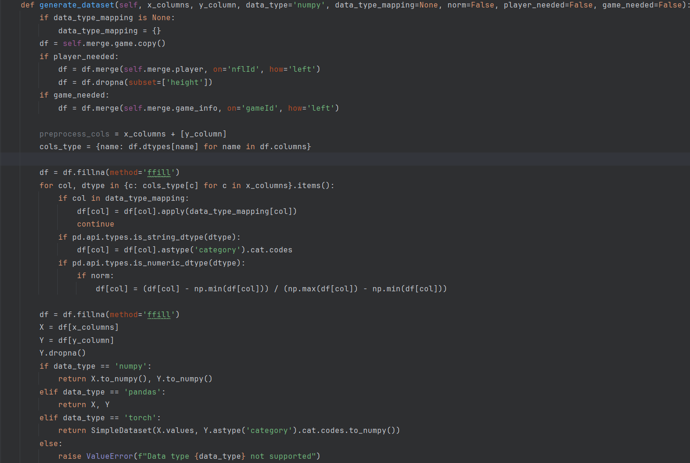

## Data Processing

---

### Structured Data Loading

This project employs object-oriented programming to implement the structured loading of all NFL data. This method boasts a clear organisational advantage and, in this version, the dataset object itself is iterable, greatly simplifying the complexity of data calls during the development process.

### Automatic Data Pre-processing and Normalisation

This functionality is available in two versions:
1. Aimed at developers, the structured dataset object allows for the direct invocation of the `.tensor()` function to obtain pre-processed data ready for neural network usage. Users simply need to specify the column names as input feature sets and target features to retrieve the corresponding tensor. The automatic pre-processing technique generates category labels by analysing the information across the dataset, converts them to index encodings, normalises numerical data, and transforms time data into timestamps. Additionally, the `resize_range_overwrite` and `category_labels_overwrite` parameters allow for custom overriding of label tables, providing substantial scalability. 
2. The other version employs a straightforward method for data loading, storing the dataframe as an object attribute. This version simplifies and clarifies the pre-processing and normalisation functions, enhancing usability and versatility without compromising ease of understanding. The `DataGenerator` takes initial objects such as `TrackingNormData`, `PffNormData`, `PlayNormData`, `GameNormData`, `PlayerNormData`, `MergeNormData` as init parameters, allowing direct operations on these classes or using the data produced post-generation for filtering. The generator's `generate_dataset` function, like the previous version, automatically processes label and numeric data, with the `data_type_mapping` parameter offering a more customisable approach to data pre-processing by mapping functions to column names, thus providing users with greater flexibility. 

### Easy Data Reorganization

1. The `GameNFLData` object integrates tracking, pff, and play data during initialisation. Each `GameNFLData` object corresponds to a single game's data, and its loading functions return a dictionary keyed by gameId.
2. The `MergeNormData` class accepts pre-loaded data objects, automatically merging key data sets. As needed, the `DataGenerator` supports parameters like `player_needed` and `game_needed` to control whether the dataset includes player or game data. 

## Modelling

---
Model development is divided into two stages:

### Training

1. The model's training phase is based on the automated dataset loading and pre-processing class. Development supports dynamic and flexible training through the `TrainingConfigure` object, allowing adjustments to input and output parameters as well as model hyperparameters, facilitating large-scale neural network validation experiments. 
2. This version directly interfaces the datasets derived from the `*NormData` series and `DataGenerator` with a gradio interface, increasing human-machine interaction efficiency and facilitating experimental condition adjustments.

Demo Video Here: neural_network_training.mp4 (whatsapp)

### Evaluation

The focus during the model validation phase is on performance. Multiple experiments have demonstrated that both neural networks and machine learning methods can effectively classify results and achieve high accuracy rates on independent validation sets. Currently, given the low complexity of the data, decision trees may outperform neural networks by 5-10% in accuracy.

### Input Feature Analysis

Using the **Captum** library to analyse the contribution rates of each input feature in the trained neural network model provides a basis for further analysis.

### Feature: Customized Experiments

The ability to freely and conveniently adjust input and output parameters for batch experiments using the control variable method is crucial. This feature is better showcased in the gradio interface, facilitating the exploration of new model possibilities.

### Machine Learning Methods

Adjustable parameters for the random forest model are now directly exposed in the Gradio UI, allowing for easy modification.

Demo Video Here: ML_training.mp4 (whatsapp)

## Visualisation

---

### Highly Customizable Statistical Charts (To Be Completed)

The implemented charts are directly generated based on agreed results. Plans are underway to incorporate dynamic components in the Gradio interface to achieve a high degree of customisation for data filtering.

### Video Visualisation

Specific GameId matches can be generated on the Gradio video generation page, with real-time display of each frame's rendering process and a front-end preview of the completed video.

Demo Video Here: Visualisation.mp4 (whatsapp)

More features to come: You can choose the dataset information displayed at the bottom of the generated video.

### Model Visualisation (Things To Do)

Combining input feature analysis with statistical charts and application results, features that change over time in a match can be visualised in videos, similar to the visualisation of object detection model results.

## Analytical Tools (To Be Completed)

The charts feature high customisability for data filtering, intended to provide numerous customisation options for statistics and chart drawing.
